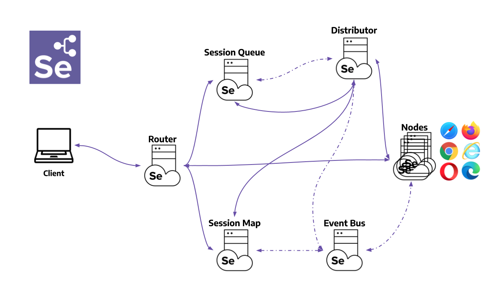

# Selenium pilot project 
by gg

---

Basically the pilot project followed [Selenium official manual](https://www.selenium.dev/documentation/webdriver/getting_started/)

## What I learned

### 1. Webdriver Manager
Most machines automatically update the browser, but the driver does not. To make sure you get the correct driver for your browser, 
there are many third party libraries to assist you.   
[Link to Manual](https://www.selenium.dev/documentation/webdriver/getting_started/)


### 2. Design patterns for Test Automation

[Link to Manual](https://www.selenium.dev/documentation/test_practices/design_strategies/)


AUT: short for Application under test

### 3. Selenium Grid


[Getting Started](https://www.selenium.dev/documentation/grid/getting_started/)

[Selenium Grid components](https://www.selenium.dev/documentation/grid/components/)

- Router 
  - The Router takes care of forwarding the request to the correct component.
  - The Router behaves differently depending on the request.
  ```
    if(request == new session request){
        //add to New Session Queue.
        
    }else if(request == existing session){
        //send session id to the Session Map.
        //Session Map return the Node where the session is running.
   }
  ```
  
- How to start Grid


